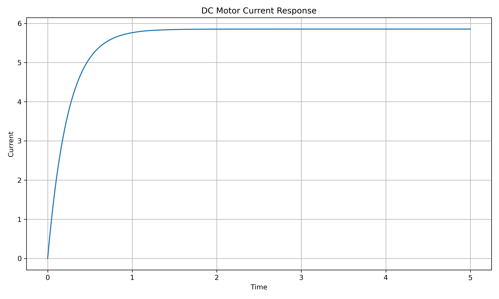
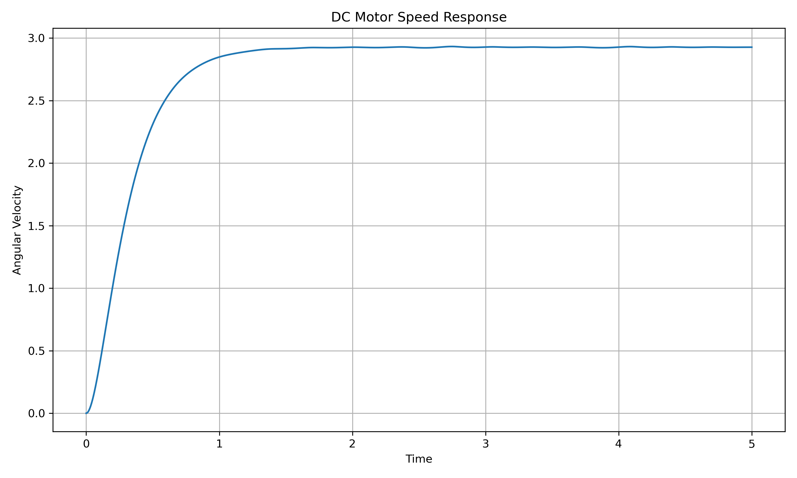
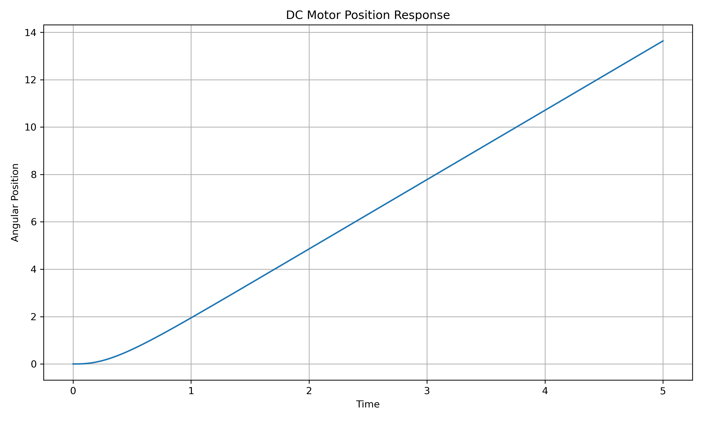
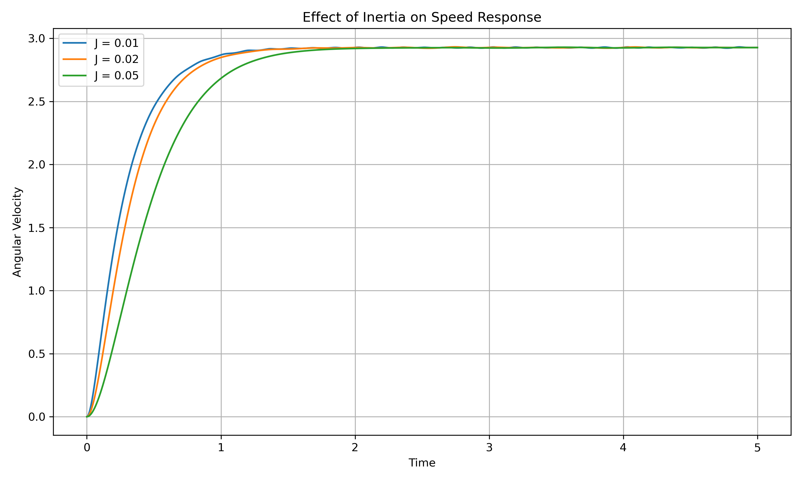
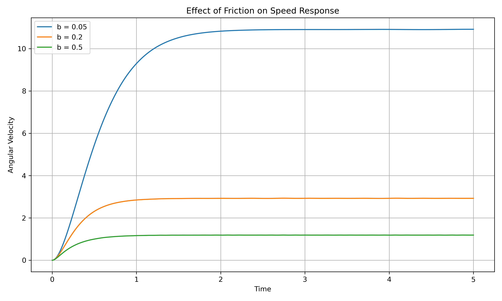

# DC Motor Simulation

Simulation and response analysis of a DC motor using a simple electromechanical dynamic model.

This project studies how electrical input voltage produces current, angular velocity, and angular position responses in a DC motor. It also explores how physical parameters such as inertia and friction affect motor behavior.

The project connects:

- electromechanical system modeling
- dynamic system simulation
- motor response analysis
- parameter sensitivity
- control-oriented physical system understanding

---

## Project Overview

A DC motor is a common electromechanical system that converts electrical energy into rotational motion.

This project models the motor using differential equations and simulates its response to a constant voltage input.

The model includes:

- electrical dynamics
- mechanical dynamics
- angular velocity
- angular position

The workflow is:

```text
DC motor model → numerical simulation → response plots → parameter analysis
```

---

## Why This Project Matters

DC motors are widely used in robotics, mechatronics, automation, and control systems.

This project provides a foundation for later work in:

- motor control
- state estimation
- Kalman filtering
- sensor-based motor monitoring
- motor modeling for control and estimation

It also connects directly to the related project:

```text
kalman-filter-dc-motor
```

where noisy speed measurements are filtered to estimate the true motor state.

---

## DC Motor Model

The system is described by:

```text
di/dt = (V - R i - Ke w) / L
dw/dt = (Kt i - b w) / J
dtheta/dt = w
```

where:

- `V` is the input voltage
- `i` is the armature current
- `w` is the angular velocity
- `theta` is the angular position
- `R` is the resistance
- `L` is the inductance
- `Ke` is the back EMF constant
- `Kt` is the torque constant
- `J` is the moment of inertia
- `b` is the damping or friction coefficient

---

## Base Parameters

The base simulation uses:

| Parameter | Value |
|---|---:|
| `R` | 2.0 |
| `L` | 0.5 |
| `Ke` | 0.1 |
| `Kt` | 0.1 |
| `J` | 0.02 |
| `b` | 0.2 |
| `V` | 12.0 |

Initial conditions:

| State | Initial Value |
|---|---:|
| `i0` | 0.0 |
| `omega0` | 0.0 |
| `theta0` | 0.0 |

---

## Simulation Scenarios

### 1. Current Response

The simulation plots the armature current over time.

This shows the electrical transient behavior of the motor after the voltage input is applied.

### 2. Speed Response

The simulation plots angular velocity over time.

The speed starts from zero and gradually approaches a steady value.

### 3. Position Response

The simulation plots angular position.

Since position is the integral of angular velocity, the position increases over time as the motor rotates.

### 4. Effect of Inertia

The project compares different moment-of-inertia values:

- `J = 0.01`
- `J = 0.02`
- `J = 0.05`

Lower inertia produces a faster speed response, while higher inertia makes the motor respond more slowly.

### 5. Effect of Friction

The project compares different friction values:

- `b = 0.05`
- `b = 0.2`
- `b = 0.5`

Lower friction allows the motor to reach a higher steady-state speed, while higher friction reduces both transient response and steady-state speed.

---

## Results

The simulation highlights several basic aspects of DC motor dynamics:

- a constant voltage produces time-varying current and speed responses
- angular velocity approaches a steady-state value
- angular position increases continuously as the motor rotates
- inertia affects acceleration and response speed
- friction affects both transient and steady-state behavior

---

## Output Figures

### Current Response

Armature current response over time.



### Speed Response

Angular velocity response over time.



### Position Response

Angular position response over time.



### Effect of Inertia

Comparison of motor speed response for different inertia values.



### Effect of Friction

Comparison of motor speed response for different friction values.



---

## Repository Structure

```text
dc-motor-simulation/
├── results/
│   ├── current_response.png
│   ├── friction_effect.png
│   ├── inertia_effect.png
│   ├── position_response.png
│   └── speed_response.png
├── src/
│   └── main.py
├── .gitignore
└── README.md
```

---

## Main File

The main simulation script is:

```text
src/main.py
```

It runs the DC motor simulation and saves the output figures in:

```text
results/
```

---

## How to Run

Create and activate a virtual environment:

```bash
python3 -m venv venv
source venv/bin/activate
```

Install the required Python packages:

```bash
pip install -r requirements.txt
```

Run the simulation from the project root:

```bash
python3 src/main.py
```

---

## Project Role in Portfolio

This project provides a foundation in electromechanical system modeling.

It supports later projects such as:

- `kalman-filter-dc-motor`
- dynamic system classification
- embedded sensor-based monitoring
- intelligent physical system projects

Together with the mass-spring-damper simulation, this project helps establish the dynamic systems side of the portfolio.

---

## Limitations

This project is intentionally simple and simulation-based.

Current limitations:

- no controller is implemented yet
- the model is simplified
- no measurement noise is included in this repository
- no real motor data is used
- the simulation focuses on open-loop voltage input

These limitations are acceptable for a foundational dynamics project and create clear directions for future extensions.

---

## Future Work

Possible next steps:

- add PID speed control
- compare different voltage inputs
- add noisy sensor measurements
- estimate parameters from simulated data
- extend the model with data-driven analysis
- connect the simulation directly to Kalman filtering
- compare open-loop and closed-loop motor behavior

---

## Summary

This project simulates the dynamic behavior of a DC motor and studies how motor parameters affect current, speed, and position responses.

It provides a compact foundation for later work in control, state estimation, Kalman filtering, and embedded motor monitoring.
